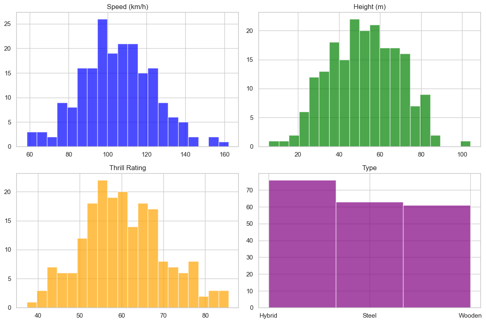
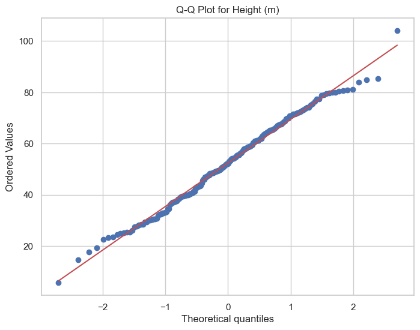

# Overview of project 1 for Programming

This project analyses synthesized roller coaster data based off the parameters of real roller coaster data. Variables of such were: speed(kph), height(m), thrill rating and type(steel,hybrid and wooden). An extensive Jupyter notebook was completed.

# Table of Contents

# Introduction
# Data Collection
# Data Synthesis
# Exploratory Data Analysis
# Variable Relationship Visualization
# Statistical Analysis
# Real vs Synthesized
# Interpretations and Conclusions
# Introduction

## Introduction
Start by investigating real-world roller coaster data. You do this as you must first understand what variables exist, how they may compare, and how you can go about synthesizing them. For example; you can use [rcdb](https://rcdb.com/os.htm?ot=2) as I did - to access real data and stats. To execute my code, you can access this project via the included github link: https://github.com/Gerbs2193/Programming-for-Data-Analytics or by git cloning to your local repo: git clone https://github.com/Gerbs2193/Programming-for-Data-Analytics. Open the jupyter notebook from there on. Data files pertinent are as follows; 'realcoasterdata.csv as wel as coasterss.csv (synthesized data). 

## Data Collection

Gathered real-world roller coaster data, including key variables like speed, height, thrill rating and type from https://rcdb.com/os.htm?ot=2. Real data is here: [Download Real Data](realcoasterdata.csv)

## Data Synthesis

Here, I created a synthesized dataset to align with real-world roller coaster characteristics. The data can be found here: [Download synthesized data](coasterss.csv). 

## Exploratory Data Analysis

Here, I carried out exploratory analysis to understand the distribution, types and relationships of my variables. Below are the histograms from one random simulation: 

Below are likewise but for the Q-Q plots:  

Variable Relationship Visualisation

Visualized relationships between roller coaster variables using scatter plots, box plots, and regression analysis.

Statistical Analysis

Applied statistical techniques, including linear regression, to quantify relationships between variables.

Real vs Synthesised

Compared and contrasted findings from the real-world dataset with those from the synthesized dataset.

Interpretations and Conclusions

Derived insights, discussed results, and presented conclusions based on the analysis.

 
 
 
 
 
 
 
 
 
 
 
 
 
 
 
 
 
 
 
 
 
 
 
 
 
 
 
 
 
 
 
 
 
 
 
 
 ## Conclusion

dhdhwydwhdyhd

