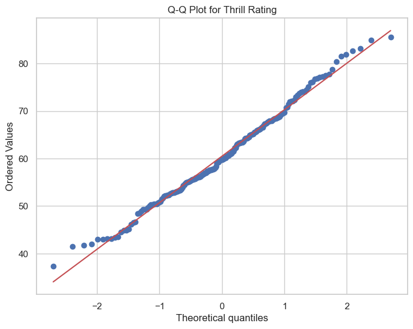
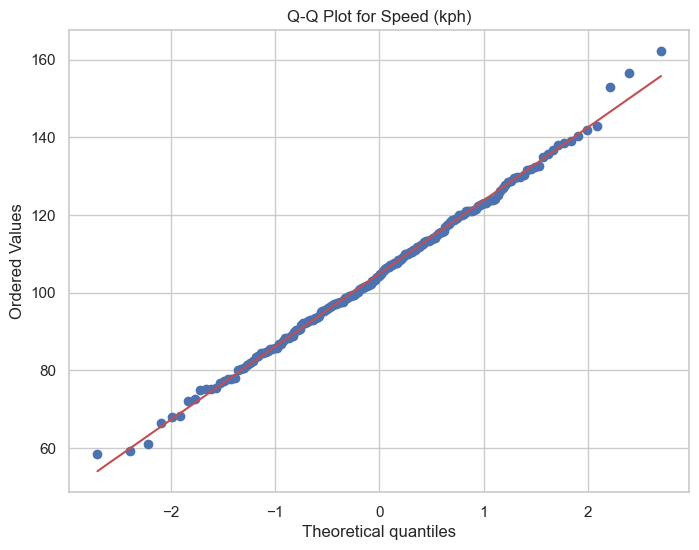
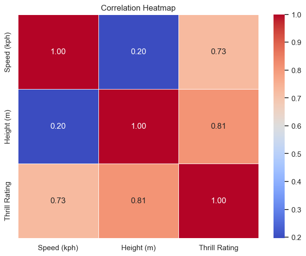
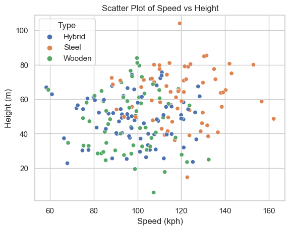
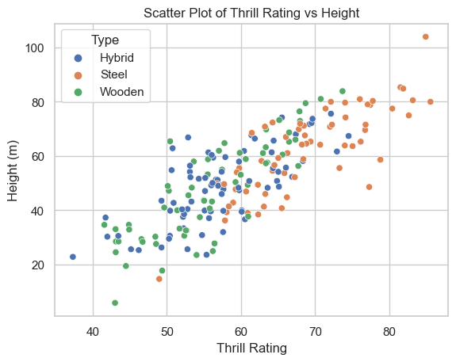
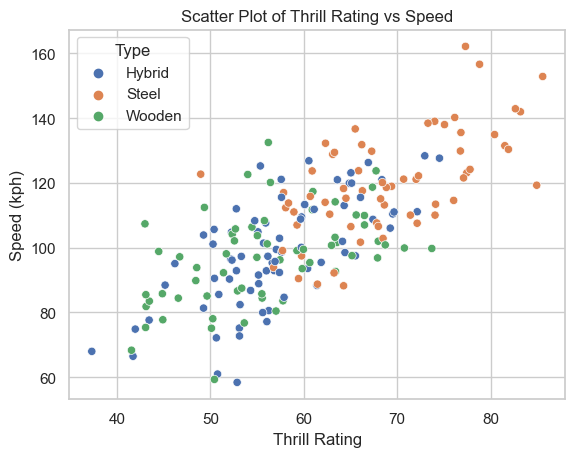
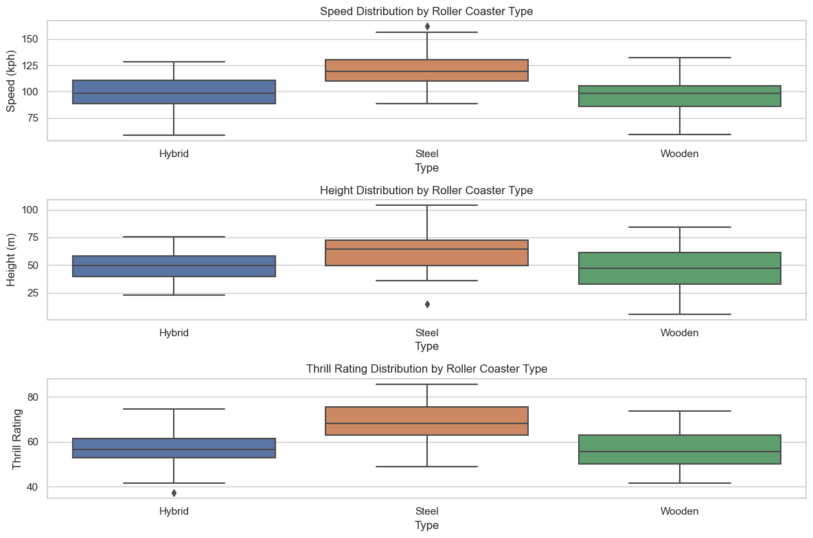
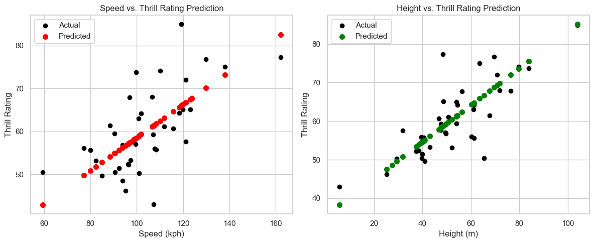
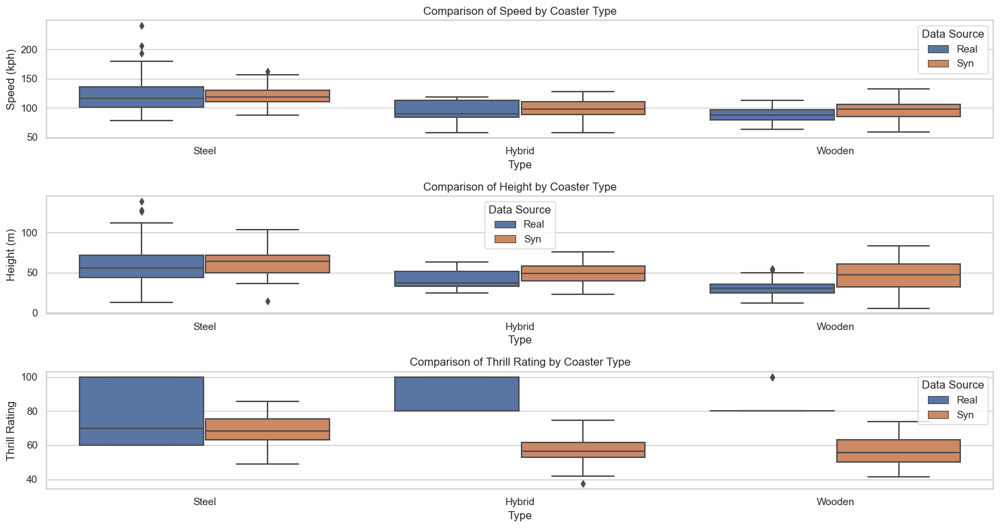
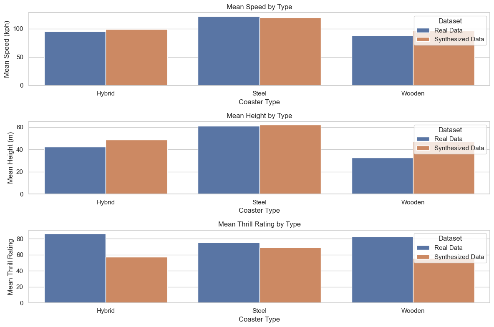

# Overview of project 1 for Programming

This project analyses synthesized roller coaster data based off the parameters of real roller coaster data. Variables of such were: speed(kph), height(m), thrill rating and type(steel,hybrid and wooden). An extensive Jupyter notebook was completed.

# Table of Contents

 Introduction

 Data Collection

 Data Synthesis

 Exploratory Data Analysis

 Variable Relationship Visualization

 Statistical Analysis

 Real vs Synthesized

 Interpretations and Conclusions
 Introduction

## Introduction
Start by investigating real-world roller coaster data. You do this as you must first understand what variables exist, how they may compare, and how you can go about synthesizing them. For example; you can use [rcdb](https://rcdb.com/os.htm?ot=2) as I did - to access real data and stats. To execute my code, you can access this project via the included github link: https://github.com/Gerbs2193/Programming-for-Data-Analytics or by git cloning to your local repo: git clone https://github.com/Gerbs2193/Programming-for-Data-Analytics. Open the jupyter notebook from there on. Data files pertinent are as follows; 'realcoasterdata.csv as wel as coasterss.csv (synthesized data). 

## Data Collection

Gathered real-world roller coaster data, including key variables like speed, height, thrill rating and type from https://rcdb.com/os.htm?ot=2. Real data is here: [Download Real Data](realcoasterdata.csv)

## Data Synthesis

Here, I created a synthesized dataset to align with real-world roller coaster characteristics. The data can be found here: [Download synthesized data](coasterss.csv). 

## Exploratory Data Analysis

Here, I carried out exploratory analysis to understand the distribution, types and relationships of my variables. Below are the histograms from one random simulation: 

Below are likewise but for the Q-Q plots:  
                                           
                                           

## Variable Relationship Visualization

Here, I Visualized relationships between roller coaster variables using correlation heatmapping, scatter plots and  box plots. Below are the results:

## Statistical Analysis
Used Linear Regression - as explained in the notebook - to gleam relationship power between the variables. Below are the visual results; 

## Real vs Synthesized Data
Last bit of analysis was comparing both real and synthesized to see how closely or otherwise they align. To do this, Box plots and bar plots were performed of which below show the findings of one simulation. Detailed summation - as always - in contained within the notebook:

## Insights, Results and conclusions
Steel coaster type remained the fastest, tallest and most thrilling of the three types. Speed, Height and Thrill were found to be of normal distribution and of continuous, numerical variables. Type was defined as a categorical variable. Linear Regression showed us that there exists a noticeable relationship between height and speed in relation to an elevated thrill rating result. These results - for the most part - aligned closely with the real results - as they should given the stipulations set during the synthesized code phase which set out mean values for the random results so as to align with the real data results. All in all, the results were mostly in line with expectations, even if thrill rating was off due to the subjectivity of such  a thing. 

 
 
 
 
 
 
 
 
 
 
 
 
 
 
 
 
 
 
 
 
 
 
 
 
 
 
 
 
 
 
 
 
 
 
 
 

